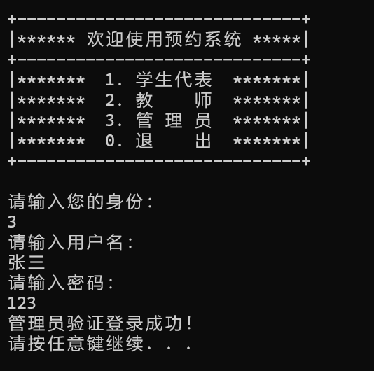
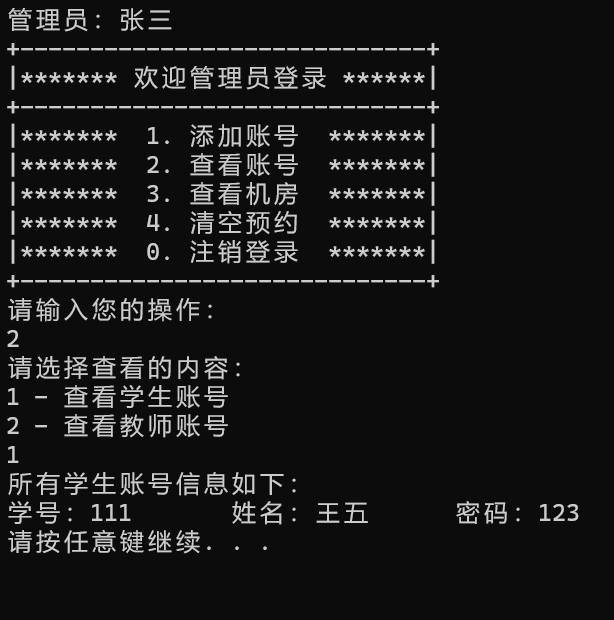
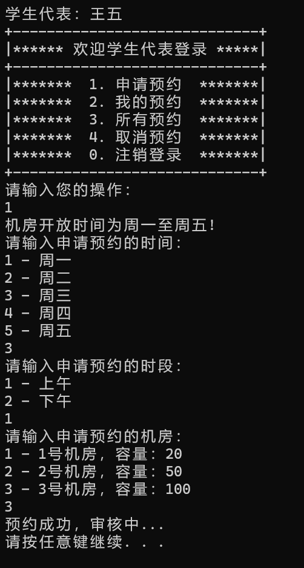
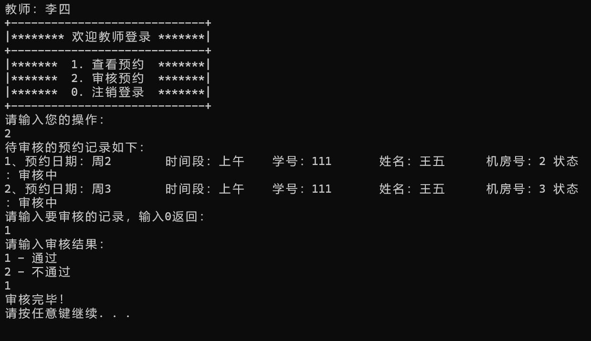
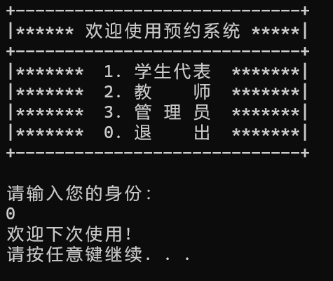

# 机房预约管理系统

**开发环境**：Visual Studio Community 2022 

## 简介

对机房资源的使用进行预约管理，避免使用冲突。支持三种不同身份用户的登录验证，使用文件存储用户信息和机房的预约信息。针对不同身份用户提供的功能如下：

- **管理员**：非管理员账号的创建与修改、查看账号信息与房间信息、清空预约记录
- **学生**：提交预约信息、取消预约、查看预约记录
- **教师**：查看预约信息、审批预约

## 展示

1. 运行前需要配置管理员和房间文件信息

```
# files/admin.txt
# 添加管理员信息，格式："姓名 密码"
张三 123

# files/rooms.txt
# 添加机房信息，格式："房间号 房间容量"
1 20
2 50
3 100
```

2. 程序运行后进入主菜单，输入身份类别进行验证



3. 管理员验证登录后进入子菜单，可进行查看账号信息等操作



4. 学生验证登录后进入子菜单，进行预约机房等操作 



5. 教师验证登录后进入子菜单，可进行审核预约信息等操作



6. 退出系统



## 总结

管理系统是学习完编程语言基础语法后的第一个练习项目，在应用中去进一步理解类的封装、继承、多态以及 STL 等容器的使用。
- 使用 `switch` 判断语句进行功能选择；封装了用户基类并继承给不同用户，通过多态由主菜单切入不同的用户子菜单。
- 使用 `admin.txt` 等文件记录用户信息，用于登录的验证，可以实践 C++ 语言的文件操作语法。
- 预约记录保存于 `order.txt` 文件，程序运行后将读入文件，并使用 `map` 容器存储 `date`、`ID` 等关键字的映射信息，使用 `vector` 容器存储用户对象等信息。
